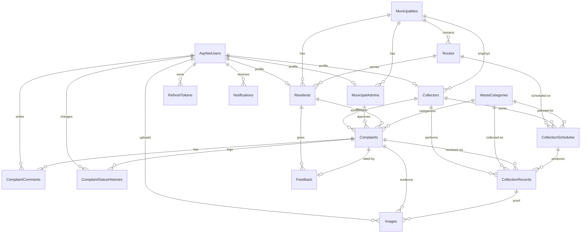

# GMS Database Design

SQL Server, EF Core 8 Code First. Table names below are the physical names that migrations will generate in Phase 2 (Identity tables use the standard `AspNet*` names).

## Table Catalog

| # | Table | Purpose | Primary Key |
|---|-------|---------|-------------|
| 1 | AspNetUsers | All accounts (extends Identity: name, active flag, audit, soft delete) | Id (int) |
| 2 | AspNetRoles | SuperAdmin, MunicipalAdmin, GarbageCollector, Resident | Id (int) |
| 3 | AspNetUserRoles | User ↔ role join (Identity) | (UserId, RoleId) |
| 4 | Municipalities | Tenant anchor: city corporation / council | Id |
| 5 | MunicipalAdmins | Admin profile, scoped to one municipality | Id |
| 6 | Residents | Resident profile: address, geo, route mapping | Id |
| 7 | Collectors | Collector profile: employee code, vehicle, availability | Id |
| 8 | Routes | Collection routes within a municipality | Id |
| 9 | WasteCategories | Plastic, Paper, Glass, Metal, Organic, E-Waste, Hazardous (seeded) | Id |
| 10 | Complaints | Uncollected-garbage reports + full workflow state | Id |
| 11 | ComplaintComments | Discussion thread per complaint (internal flag for staff) | Id |
| 12 | ComplaintStatusHistories | Append-only status transition log | Id |
| 13 | CollectionSchedules | Planned pickups: route × collector × date × time window | Id |
| 14 | CollectionRecords | Executed pickups: GPS, weight, proof photos | Id |
| 15 | Images | Upload metadata for complaint evidence / collection proof / profile | Id |
| 16 | Notifications | In-app (and later email) notifications per user | Id |
| 17 | Feedback | Resident ratings (per complaint or general) | Id |
| 18 | RefreshTokens | Rotating JWT refresh tokens | Id |

## ER Diagram (text / Mermaid)

Legend: `||--o{` = one-to-many · `||--o|` = one-to-zero-or-one.

## Foreign Keys & Relationship Rules

| Child table | FK column | References | Cardinality | Nullable | Notes |
|---|---|---|---|---|---|
| Residents | UserId | AspNetUsers.Id | 1:1 | No | Unique index |
| Residents | MunicipalityId | Municipalities.Id | N:1 | No | |
| Residents | RouteId | Routes.Id | N:1 | Yes | Household may be unmapped |
| Collectors | UserId | AspNetUsers.Id | 1:1 | No | Unique index |
| Collectors | MunicipalityId | Municipalities.Id | N:1 | No | |
| MunicipalAdmins | UserId | AspNetUsers.Id | 1:1 | No | Unique index |
| MunicipalAdmins | MunicipalityId | Municipalities.Id | N:1 | No | |
| Routes | MunicipalityId | Municipalities.Id | N:1 | No | Code unique per municipality |
| Complaints | ResidentId | Residents.Id | N:1 | No | Restrict delete |
| Complaints | WasteCategoryId | WasteCategories.Id | N:1 | Yes | |
| Complaints | AssignedCollectorId | Collectors.Id | N:1 | Yes | Set on assignment |
| Complaints | ApprovedByAdminId | MunicipalAdmins.Id | N:1 | Yes | Set on approval |
| ComplaintComments | ComplaintId | Complaints.Id | N:1 | No | Cascade |
| ComplaintComments | AuthorUserId | AspNetUsers.Id | N:1 | No | Restrict |
| ComplaintStatusHistories | ComplaintId | Complaints.Id | N:1 | No | Cascade |
| ComplaintStatusHistories | ChangedByUserId | AspNetUsers.Id | N:1 | No | Restrict |
| CollectionSchedules | RouteId | Routes.Id | N:1 | No | |
| CollectionSchedules | CollectorId | Collectors.Id | N:1 | No | |
| CollectionSchedules | WasteCategoryId | WasteCategories.Id | N:1 | Yes | Null = general pickup |
| CollectionRecords | CollectionScheduleId | CollectionSchedules.Id | N:1 | Yes | See CHECK below |
| CollectionRecords | ComplaintId | Complaints.Id | N:1 | Yes | See CHECK below |
| CollectionRecords | CollectorId | Collectors.Id | N:1 | No | |
| CollectionRecords | WasteCategoryId | WasteCategories.Id | N:1 | Yes | |
| Images | UploadedByUserId | AspNetUsers.Id | N:1 | No | |
| Images | ComplaintId | Complaints.Id | N:1 | Yes | |
| Images | CollectionRecordId | CollectionRecords.Id | N:1 | Yes | |
| Notifications | UserId | AspNetUsers.Id | N:1 | No | Cascade |
| Feedback | ResidentId | Residents.Id | N:1 | No | |
| Feedback | ComplaintId | Complaints.Id | N:1 | Yes | Unique filtered index (one feedback per complaint) |
| RefreshTokens | UserId | AspNetUsers.Id | N:1 | No | Cascade; Token unique |

## Constraints & Indexes (applied via Fluent API in Phase 2)

- `Complaints.TrackingCode` — unique index (format `CMP-{year}-{sequence}` generated in the service layer).
- `Collectors.EmployeeCode` — unique per municipality (composite unique index `MunicipalityId + EmployeeCode`).
- `Routes.Code` — unique per municipality.
- `WasteCategories.Name` — unique.
- `RefreshTokens.Token` — unique.
- `CollectionRecords` — CHECK: `CollectionScheduleId IS NOT NULL OR ComplaintId IS NOT NULL` (a record must belong to a scheduled run or a complaint resolution).
- `Feedback.Rating` — CHECK: `Rating BETWEEN 1 AND 5`.
- `CollectionRecords.WeightKg` — `decimal(10,2)`.
- Hot-path non-clustered indexes: `Complaints(Status)`, `Complaints(ResidentId)`, `Complaints(AssignedCollectorId)`, `CollectionSchedules(ScheduledDate)`, `Notifications(UserId, IsRead)`.
- Global query filter `IsDeleted = 0` on every `ISoftDeletable` entity; deletes are converted to updates by a `SaveChanges` interceptor.
- Multiple nullable FKs pointing at the same tables (e.g. `CollectionRecords` → `Complaints`/`CollectionSchedules`) use `DeleteBehavior.Restrict`/`NoAction` to avoid SQL Server multiple-cascade-path errors.

## Key Design Decisions

1. **Identity in the Domain layer.** `ApplicationUser : IdentityUser<int>` lives in `GMS.Domain.Identity` so profile entities (`Resident`, `Collector`, `MunicipalAdmin`) can hold real navigation properties. Cost: Domain references `Microsoft.Extensions.Identity.Stores` (POCO-only, no EF/ASP.NET). Benefit: no shadow-join gymnastics in every query. Pragmatic and widely used at this scale.
2. **User vs role profiles.** Authentication data lives once in `AspNetUsers`; role-specific operational data lives in 1:1 profile tables. Adding a role never widens the user table.
3. **`Municipalities` added beyond the spec list.** Super Admin "manages Municipal Admins" needs an object to scope them to; routes, staff and residents all hang off it. Makes the system multi-municipality from day one.
4. **`ComplaintStatusHistories` + `ComplaintComments` + `RefreshTokens` added** to back explicitly requested features (status tracking, comments, refresh tokens) with proper tables instead of JSON blobs.
5. **`WasteCategories` as data, not enum** — admins can add categories without redeploying; statuses/priorities stay as enums because they drive code paths.
6. **Soft delete + audit via interfaces** (`ISoftDeletable`, `IAuditableEntity`) so Phase 2 can implement both once, generically, in an EF interceptor.
7. **UTC everywhere**, `DateOnly`/`TimeOnly` for schedules (native SQL Server `date`/`time` in EF Core 8).
